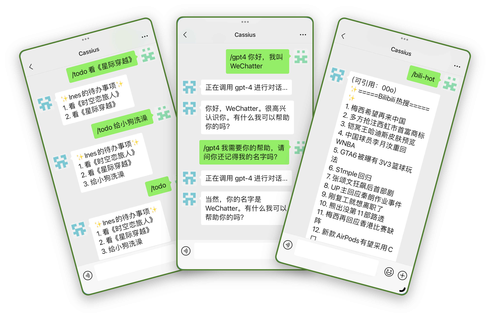
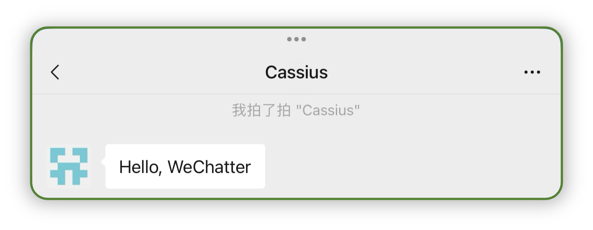
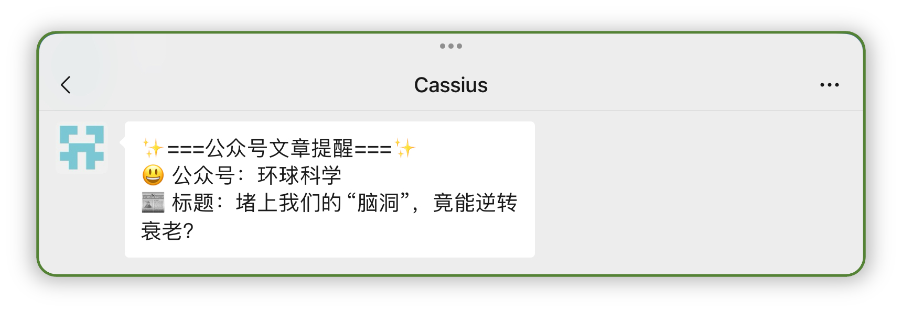
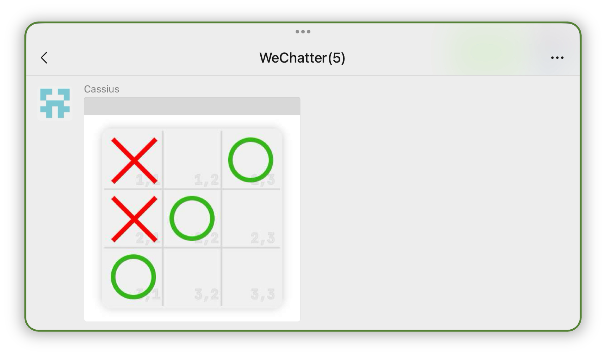
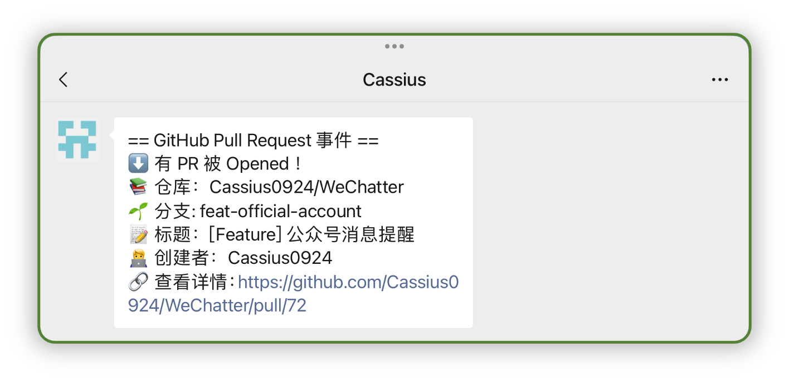

# WeChatter: Make WeChat Better

<div align="center">

[](https://github.com/Cassius0924/WeChatter/actions/workflows/test.yml)
[](https://github.com/Cassius0924/WeChatter/releases)
[](https://github.com/Cassius0924/WeChatter/blob/master/LICENSE)


</div>

## 介绍

一个基于 [wechatbot-webhook](https://github.com/danni-cool/wechatbot-webhook) 的微信机器人💬，支持 GPT 问答、热搜推送、天气预报、消息转发、小游戏、Webhook 提醒等功能。

[](docs/command_show.md)

## 快速开始

WeChatter 支持 [Docker Compose 部署](#docker-compose-部署)、[Docker 部署](./docs/development.md#docker-部署)和[本地部署](./docs/development.md#本地部署)。

> [!TIP]
> 推荐使用 Docker-compose 部署。

### Docker Compose 部署

1. 下载 WeChatter 配置文件

```bash
mkdir WeChatter && cd WeChatter
wget -O config_cps.yaml https://cdn.jsdelivr.net/gh/cassius0924/wechatter@master/config_cps.yaml.example
```

2. 编辑 `config_cps.yaml` 配置文件

```bash
vim config_cps.yaml
```

3. 下载 docker-compose.yml

```bash
wget https://cdn.jsdelivr.net/gh/cassius0924/wechatter@master/docker-compose.yml
```

4. 运行 Docker Compose

```bash
docker-compose -f docker-compose.yml up
```

5. 登录微信

使用微信扫描终端输出的二维码登录微信。

6. 测试机器人

使用另一个微信尝试拍一拍机器人或给机器人发送 `/help` 指令。



## 支持的命令

- [x] GPT 问答（不支持定时任务）
- [x] Bilibili 热搜
- [x] 知乎热搜
- [x] 微博热搜
- [x] 抖音热搜
- [x] GitHub 趋势
- [x] 单词词语翻译（不支持定时任务）
- [x] 少数派早报
- [x] 历史上的今天
- [x] 二维码生成
- [x] 待办清单（不支持定时任务）
- [x] 人民日报 PDF
- [x] 天气预报
- [x] 食物热量
- [x] 冷知识
- [x] 中石化92号汽油指导价

> [!TIP]
> 命令帮助请使用 `/help` 命令查询或查看[命令功能展示](docs/command_show.md)。

## 支持的功能

- [x] **掉线提醒**：当机器人掉线时，通过 Bark 推送提醒消息。
- [x] **消息可引用回复**：用户可以通过引用并回复命令消息进一步获取消息内容。带`（可引用：***）`的机器人消息即为可进一步互动的可引用消息。
- [x] **消息转发**：转发用户或群的消息到其他用户或群，并支持引用回复转发消息。需进行[配置](#%EF%B8%8F-message-forwarding-配置)。


- [x] **公众号提醒**：当指定公众号发布新文章时，机器人会给指定用户或群发送提醒。需进行[配置](#%EF%B8%8F-official-account-reminder-配置)。


- [x] **定时任务**：大部分命令均支持定时任务。需进行[配置](#%EF%B8%8F-task-cron-配置)。
- [x] **Discord 消息转发**：基于 Discord Webhook，将微信消息转发到 Discord 频道。需进行[配置](#%EF%B8%8F-discord-message-forwarding-配置)。

## 支持的游戏

- [x] **井字棋**：双人游戏，图片游戏。


> [!TIP]
> 游戏相关命令帮助请使用查阅[游戏基本命令](docs/command_show.md#游戏基本命令)。

## 支持的 Webhook

- [x] GitHub 仓库 Webhook，需在 GitHub 仓库 Settings 中添加 Webhook 并进行[配置](#%EF%B8%8F-github-webhook-配置)。


## 配置文件

项目根目录中的 `config.yaml.example` 为配置文件模版，首次启动项目前需要复制一份配置文件，并命名为 `config.yaml`。 编辑 `config.yaml`。

下表为配置项解释：

### ⚙️ WeChatter 配置

| 配置项 | 解释 | 备注 |
| --- | --- |  --- |
| `wechatter_port` | WeChatter服务器的端口，接受消息的端口 | 默认为 `4000`，需和 `wxbotwebhook` Docker 的 `RECV_MSG_API` 参数的端口一致 |

### ⚙️ WxBotWebhook 配置

| 配置项 | 解释 | 备注 |
| --- | --- | --- |
| `wx_webhook_base_api`      | 发送消息的 BaseAPI | 默认为 `http://localhost:3001`，即 `wxBotWebhook` Docker 的地址。Docker Compose 部署时默认为 `http://wxbotwebhook:3001` |
| `wx_webhook_recv_api_path` | 接收消息的接口路径  | 默认为 `/receive_msg`，此路径为 Docker 参数 `RECVD_MSG_API` 的路径 |
| `wx_webhook_token` | wxBotWebhook 的 Token | Docker Compose 部署时默认为 `wechatter` |

### ⚙️ Admin 配置

| 配置项 | 解释 | 备注 |
| --- | --- | --- |
| `admin_list` | 设置管理员,用于接收机器人状态变化通知 | 填入管理员微信名（不是备注） |
| `admin_group_list` | 与 `admin_list` 同理，接收机器人状态变化通知 | 填入群名称（不是群备注） |
| `bark_url` | 用于接收机器人状态变化通知的 Bark URL | [Bark](https://github.com/Finb/Bark) 仅限 iOS 和 iPadOS |

### ⚙️ Bot 配置

| 配置项 | 解释 | 备注 |
| --- | --- | --- |
| `bot_name` | 微信机器人的名字 | 微信名称，非微信号 |

### ⚙️ Chat 配置

| 配置项 | 解释 | 备注 |
| --- | --- | --- |
| `command_prefix` | 机器人命令前缀 | 默认为 `/` ，可以设置为`>>`、`!` 等任意字符，可以为空，此项为空时触发命令不需要命令前缀 |
| `need_mentioned` | 群聊中的命令是否需要@机器人 | 默认为 `False` |
| `ban_person_list` | 黑名单用户列表 | 机器人不会响应黑名单用户的消息 |
| `ban_group_list` | 黑名单群列表 | 机器人不会响应黑名单群的消息 |

### ⚙️ LLM 配置

| 配置项 | 解释 |  备注 |
| --- | --- | --- |
| `openai_base_api` | OpenAI 服务的 BaseAPI | 默认为 `https://api.openai.com` |
| `openai_token` | OpenAI Token（Key） | 以 `sk_` 开头的字符串密钥 |

### ⚙️ GitHub Webhook 配置

| 配置项 | 解释 | 备注 |
| --- | --- | --- |
| `github_webhook_enabled` | 功能开关，是否接收 GitHub Webhook | 默认为 `False` |
| `github_webhook_api_path` | 接收 GitHub Webhook 的接口路径 | 默认为 `/webhook/github` |
| `github_webhook_receiver_list` | 接收 GitHub Webhook 的微信用户 | |
| `github_webhook_receive_group_list` | 接收 GitHub Webhook 的微信群 | |

### ⚙️ Message Forwarding 配置

| 配置项 | 子项 | 解释 | 备注 |
| --- | --- |  --- | --- |
| `message_forwarding_enabled` | | 功能开关，是否开启消息转发 | 默认为 `False` |
| `message_forwarding_rule_list` | | 消息规则列表，每个规则包含四个字段：`from_list`、`from_list_exclude`、`to_person_list` 和 `to_group_list` |  |
| | `from_list` | 消息转发来源列表，即消息发送者 | 可以填多个用户名称或群名称，若要转发所有消息则使用 `["%ALL"]` |
| | `from_list_exclude` | 消息转发来源排除列表，不转发此列表的用户和群 | 只在 `from_list` 为 `["%ALL"]` 时生效 |
| | `to_person_list` | 消息转发目标用户列表，即消息接收用户 | 可以填多个用户名称或为空列表 |
| | `to_group_list` | 消息转发目标群列表，即消息接收群 | 可以填多个群名称或为空列表 |

### ⚙️ Official Account Reminder 配置

| 配置项 | 子项 | 解释 | 备注 |
| --- | --- |  --- | --- |
| `official_account_reminder_enabled` | | 功能开关，是否开启消息转发 | 默认为 `True` |
| `official_account_reminder_rule_list` | | 消息规则列表，每个规则包含三个字段：`oa_name_list`、`to_person_list` 和 `to_group_list` |  |
| | `oa_name_list` | 公众号名称列表 | 可以填多个公众号名称 |
| | `to_person_list` | 消息转发目标用户列表，即消息接收用户 | 可以填多个用户名称或为空列表 |
| | `to_group_list` | 消息转发目标群列表，即消息接收群 | 可以填多个群名称或为空列表 |

### ⚙️ Task Cron 配置

| 配置项 | 解释 | 备注 |
| --- | --- | --- |
| `all_task_cron_enabled` | 所有定时任务的总开关 | 默认为 `True` |
| `task_cron_list` | 定时任务列表，每个任务包含四个字段：`task`、`enabled`、`cron` 和 `commands` | |

关于定时任务配置详细请参阅[定时任务配置详细](docs/task_cron_config_detail.md)。

### ⚙️ Custom Command Key 配置

| 配置项 | 解释 | 备注 |
| --- | --- | --- |
| `custom_command_key_dict` | 自定义命令关键词字典，格式为 `command: [key1, key2, ...]`, 其中 `command` 为命令名称，`key1` 和 `key2` 为自定义命令关键词 |  |

关于命令名称可选值请参阅[自定义命令关键词配置详细](docs/custom_command_key_config_detail.md)。

### ⚙️ Discord Message Forwarding 配置

| 配置项 | 子项 | 解释 | 备注 |
| --- | --- | --- | --- |
| `discord_message_forwarding_enabled` | | 功能开关，是否开启 Discord 消息转发 | 默认为 `False` |
| `discord_message_forwarding_rule_list` | | 消息规则列表，每个规则包含三个字段：`from_list`、`to_discord_webhook_url` 和 `to_discord_webhook_name` |
| | `from_list` | 消息转发来源列表，即消息发送者 | 可以填多个用户名称或群名称，若要转发所有消息则使用 `["%ALL"]` |
| | `from_list_exclude` | 消息转发来源排除列表，不转发此列表的用户和群 | 只在 `from_list` 为 `["%ALL"]` 时生效 |
| | `discord_webhook_url` | 消息转发目标 Discord Webhook URL | |

### ⚙️ GPT Mode Person 配置

| 配置项 | 解释 | 备注 |
| --- | --- | --- |
| `gpt_mode_person_list` | 默认为 GPT 问答模式的用户列表 | 即带命令关键词的消息会正常触发相对应的命令，其余消息均判断为GPT命令 |
| `gpt_model` | 默认 GPT 问答的模型 | 可选值为 `gpt35`、`gpt4` |


## 日志文件

日志文件存放在项目根目录下的 `logs/` 文件夹中。

默认的日志记录级别为 `INFO`，日志记录级别可选值有 `DEBUG`、`INFO`、`WARNING`、`ERROR`、`CRITICAL`。
 
### Docker Compose 部署时

若需要调整日志记录级别，请修改 `docker-compose.yml` 文件中的 `WECHATTER_LOG_LEVEL` 环境变量。

### Docker 部署时

请修改 `docker run` 命令中的 `WECHATTER_LOG_LEVEL` 环境变量。

### 本地部署时

请修改系统环境变量 `WECHATTER_LOG_LEVEL`。

```bash
export WECHATTER_LOG_LEVEL=DEBUG
```

## 贡献者

***Thanks to the following people who have contributed to this project:***

[](https://github.com/Cassius0924/WeChatter/graphs/contributors)

## 插件化

> [!NOTE]
> 开发中...

> [!WARNING]
> 本项目仍在开发中，欢迎提出建议和意见。
