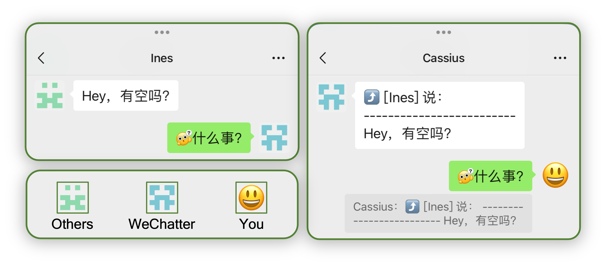

# WeChatter: Make WeChat Better

<div align="center">

[](https://github.com/Cassius0924/WeChatter/actions/workflows/test.yml)
[](https://github.com/Cassius0924/WeChatter/releases)
[](https://github.com/Cassius0924/WeChatter/blob/master/LICENSE)


</div>

## 介绍

一个基于 [wechatbot-webhook](https://github.com/danni-cool/wechatbot-webhook) 的微信机器人💬，支持 GPT 问答、热搜推送、天气预报、消息转发、Webhook提醒等功能。

[](docs/command_show.md)


## 快速开始

### 运行 wechatbot-webhook

1. 拉取 Docker 镜像

```bash
docker pull dannicool/docker-wechatbot-webhook
```

2. 运行 Docker

```bash
docker run -d \
--name wxBotWebhook \
-p 3001:3001 \
-e LOGIN_API_TOKEN="<Token>" \
-e RECVD_MSG_API="http(s)://<宿主机IP>:<接收消息端口>/receive_msg" \
dannicool/docker-wechatbot-webhook
```

- `<Token>`：登录令牌（可选）
- `<宿主机IP>`：填入 Docker 的宿主机地址。
- `<接收消息端口>`：设置一个接收消息的端口，默认为 `4000`。

3. 登录微信

使用下面命令查看 Docker 日志中的微信二维码，扫码登录微信。

```bash
docker logs -f wxBotWebhook
```

### 启动 WeChatter

1. 下载源代码

```bash
git clone https://github.com/Cassius0924/WeChatter
cd WeChatter
```

2. 安装依赖项

```bash
# 如果需要，可创建虚拟环境...

pip install -r requirements.txt
```

3. 复制并编辑配置文件

```bash
cp config.yaml.example config.yaml
vim config.yaml
```

4. 启动 WeChatter

```bash
python3 -m wechatter
```

5. 测试机器人

使用另一个微信给机器人发送 `/help` 指令。

## 支持的命令

- [x] GPT 问答，基于 [Copilot-GPT4-Service](https://github.com/aaamoon/copilot-gpt4-service)（不支持定时任务）
- [x] Bilibili 热搜
- [x] 知乎热搜
- [x] 微博热搜
- [x] 抖音热搜
- [x] GitHub 趋势
- [x] 单词词语翻译（不支持定时任务）
- [x] 少数派早报
- [x] 历史上的今天
- [x] 二维码生成
- [x] 待办清单（不支持定时任务）
- [x] 人民日报 PDF
- [x] 天气预报
- [x] 食物热量
- [x] 冷知识
- [x] 中石化92号汽油指导价

> [!TIP]
> 命令帮助请使用 `/help` 命令查询或查看[命令功能展示](docs/command_show.md)。

## 支持的功能

- [x] **消息可引用回复**： 用户可以通过引用并回复命令消息进一步获取消息内容。带`（可引用：***）`的机器人消息即为可进一步互动的可引用消息。
- [x] **消息转发**： 转发用户或群的消息到其他用户或群，并支持引用回复转发消息。需进行[配置](#%EF%B8%8F-message-forwarding-配置)。


- [x] **定时任务**：大部分命令均支持定时任务。需进行[配置](#%EF%B8%8F-task-cron-配置)。

## 支持的 Webhook

- [x] GitHub 仓库 Webhook，需在 GitHub 仓库 Settings 中添加 Webhook 并进行[配置](#%EF%B8%8F-github-webhook-配置)。

## 配置文件

项目根目录中的 `config.yaml.example` 为配置文件模版，首次启动项目前需要复制一份配置文件，并命名为 `config.yaml`。 编辑 `config.yaml`。

下表为配置项解释：

### ⚙️ WeChatter 配置

| 配置项 | 解释 | 备注 |
| --- | --- |  --- |
| `wechatter_port` | WeChatter服务器的端口，接受消息的端口 | 默认为 `4000`，需和 `wxbotwebhook` Docker 的 `RECV_MSG_API` 参数的端口一致 |

### ⚙️ WxBotWebhook 配置

| 配置项 | 解释 | 备注 |
| --- | --- | --- |
| `wx_webhook_base_api`      | 发送消息的 BaseAPI | 默认为 `localhost:3001`，即 `wxBotWebhook` Docker 的地址 |
| `wx_webhook_recv_api_path` | 接收消息的接口路径  | 默认为 `/receive_msg`，此路径为 Docker 参数 `RECVD_MSG_API` 的路径 |

### ⚙️ Admin 配置

| 配置项 | 解释 | 备注 |
| --- | --- | --- |
| `admin_list` | 设置管理员,用于接收机器人状态变化通知 | 填入管理员微信名（不是备注） |
| `admin_group_list` | 与 `admin_list` 同理，接收机器人状态变化通知 | 填入群名称（不是群备注） |

### ⚙️ Bot 配置

| 配置项 | 解释 | 备注 |
| --- | --- | --- |
| `bot_name` | 微信机器人的名字 | 微信名称，非微信号 |

### ⚙️ Chat 配置

| 配置项 | 解释 | 备注 |
| --- | --- | --- |
| `command_prefix` | 机器人命令前缀 | 默认为 `/` ，可以设置为`>>`、`!` 等任意字符 |
| `need_mentioned` | 群聊中的命令是否需要@机器人 | 默认为 `True` |

### ⚙️ Copilot GPT4 配置

| 配置项 | 解释 |  备注 |
| --- | --- | --- |
| `cp_gpt4_base_api` | CopilotGPT4 服务的 BaseAPI | 默认为 `http://localhost:8080` |
| `cp_token` | GitHub Copilot 的 Token | 以 `ghu_` 开头的字符串 |

### ⚙️ GitHub Webhook 配置

| 配置项 | 解释 | 备注 |
| --- | --- | --- |
| `github_webhook_enabled` | 功能开关，是否接收 GitHub Webhook | 默认为 `False` |
| `github_webhook_api_path` | 接收 GitHub Webhook 的接口路径 | 默认为 `/webhook/github` |
| `github_webhook_receiver_list` | 接收 GitHub Webhook 的微信用户 | |
| `github_webhook_receive_group_list` | 接收 GitHub Webhook 的微信群 | |

### ⚙️ Message Forwarding 配置

| 配置项 | 子项 | 解释 | 备注 |
| --- | --- |  --- | --- |
| `message_forwarding_enabled` | | 功能开关，是否开启消息转发 | 默认为 `False` |
| `message_forwarding_rule_list` | | 消息规则列表，每个规则包含三个字段：`from_list`、`to_person_list` 和 `to_group_list` |  |
| | `from_list` | 消息转发来源列表，即消息发送者 | 可以填多个用户名称或群名称 |
| | `to_person_list` | 消息转发目标用户列表，即消息接收用户 | 可以填多个用户名称或为空列表 |
| | `to_group_list` | 消息转发目标群列表，即消息接收群 | 可以填多个群名称或为空列表 |

### ⚙️ Task Cron 配置

| 配置项 | 解释 | 备注 |
| --- | --- | --- |
| `all_task_cron_enabled` | 所有定时任务的总开关 | 默认为 `True` |
| `task_cron_list` | 定时任务列表，每个任务包含四个字段：`task`、`enabled`、`cron` 和 `commands` | |

[//]: # (引导用户查看定时任务配置详细docs/task_cron_config_detail)
关于定时任务配置详细请参阅[定时任务配置详细](docs/task_cron_config_detail.md)。

### ⚙️ Custom Command Key 配置

| 配置项 | 解释 | 备注 |
| --- | --- | --- |
| `custom_command_key_dict` | 自定义命令关键词字典，格式为 `command: [key1, key2, ...]`, 其中 `command` 为命令名称，`key1` 和 `key2` 为自定义命令关键词 |  |

关于命令名称可选值请参阅[自定义命令关键词配置详细](docs/custom_command_key_config_detail.md)。

## 日志文件

日志文件存放在项目根目录下的 `logs/` 文件夹中。

默认的日志记录级别为 `INFO`，若需要调整日志记录级别，请修改环境变量 `WECHATTER_LOG_LEVEL`，可设置 `DEBUG`、`INFO`、`WARNING`、`ERROR`、`CRITICAL`。

```bash
export WECHATTER_LOG_LEVEL=DEBUG
```

## 贡献者

***Thanks to the following people who have contributed to this project:***

[](https://github.com/Cassius0924/WeChatter/graphs/contributors)

## 插件化

> [!NOTE]
> 开发中...

> [!WARNING]
> 本项目仍在开发中，欢迎提出建议和意见。
