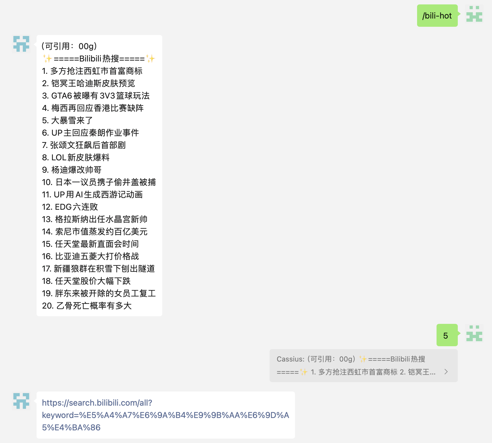
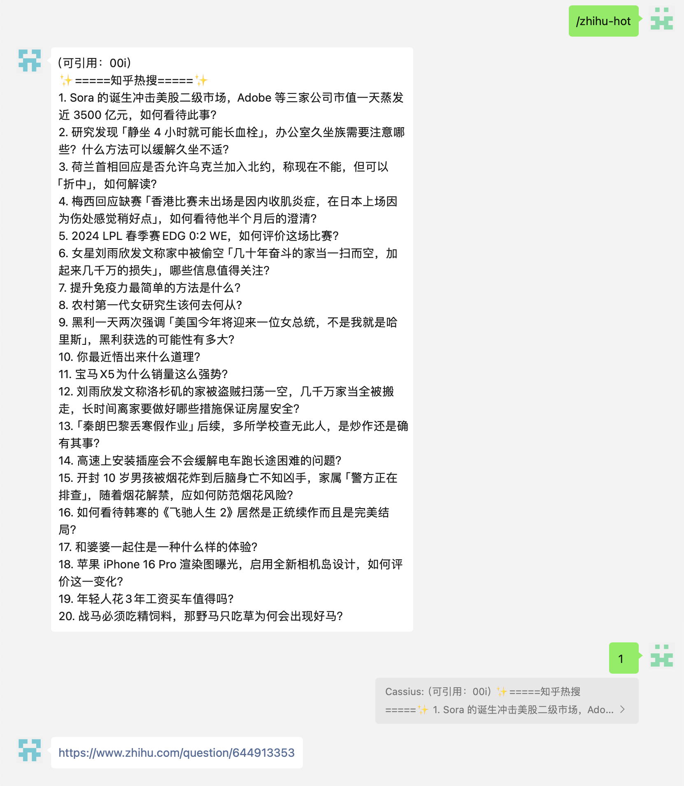
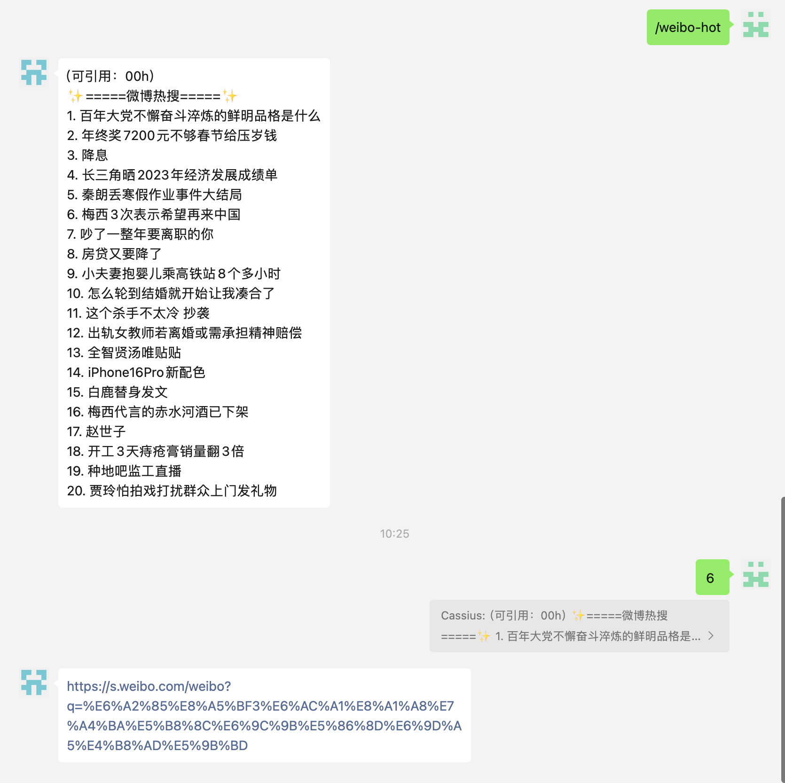
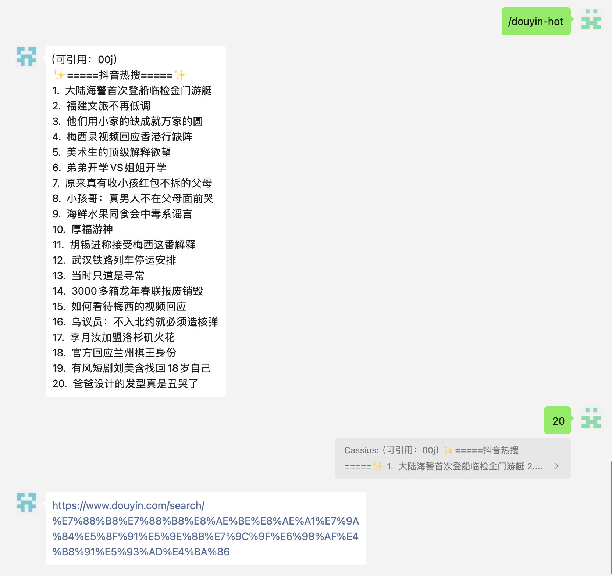
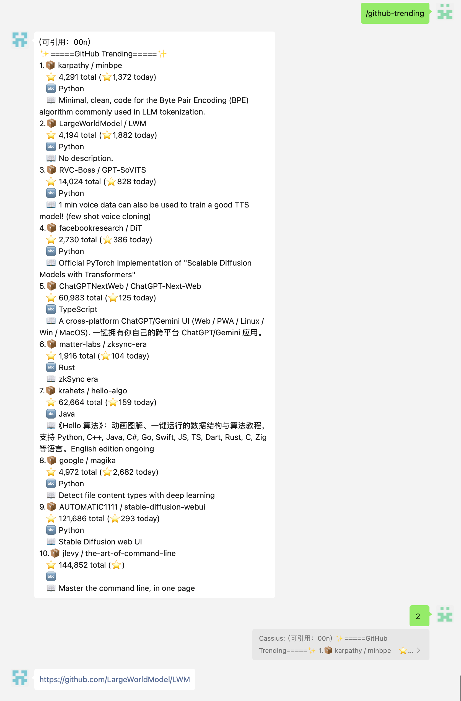
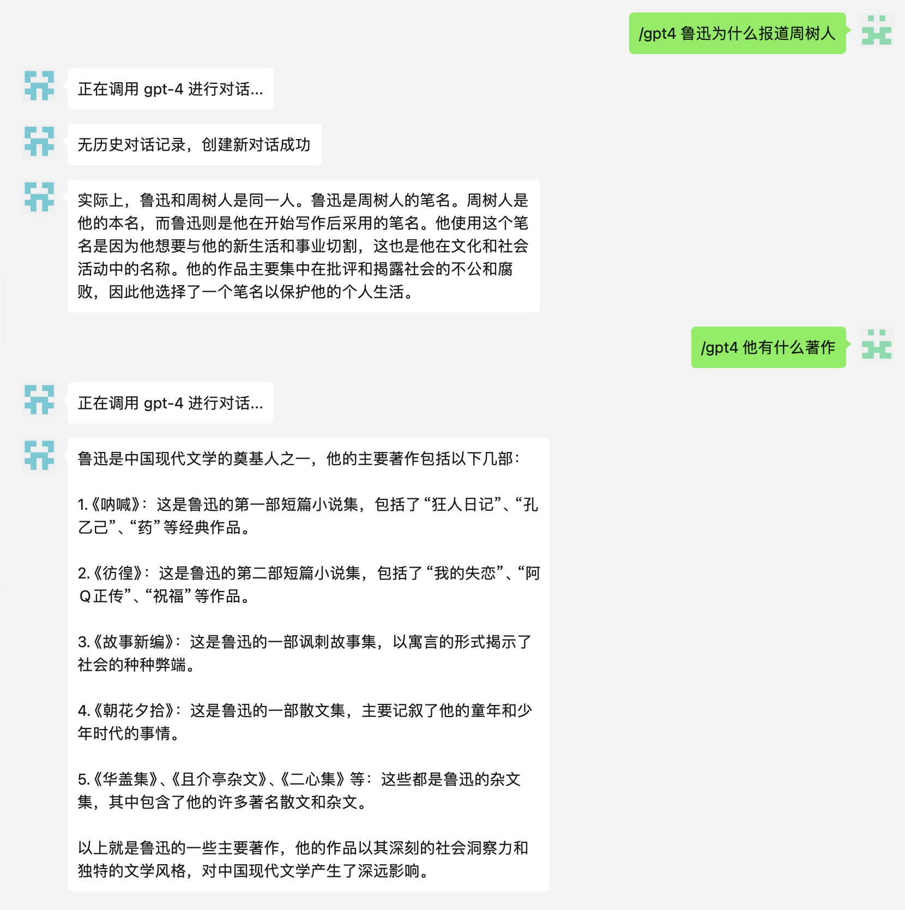
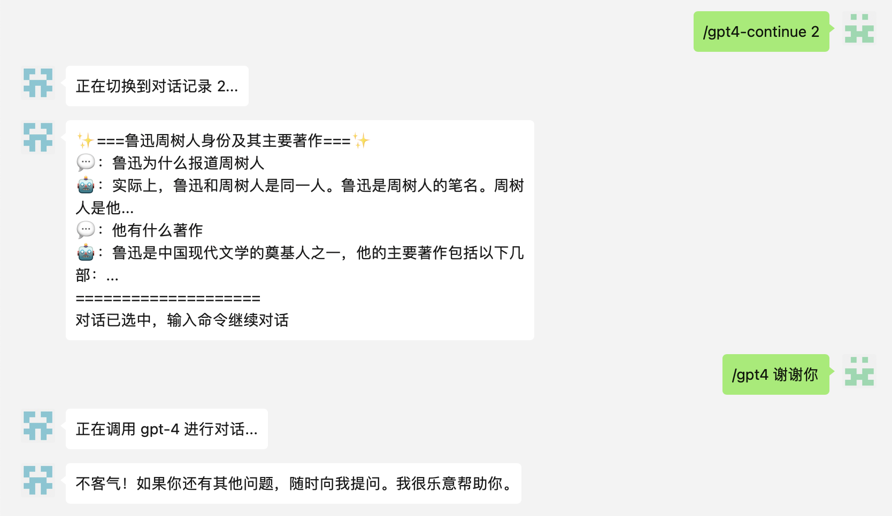
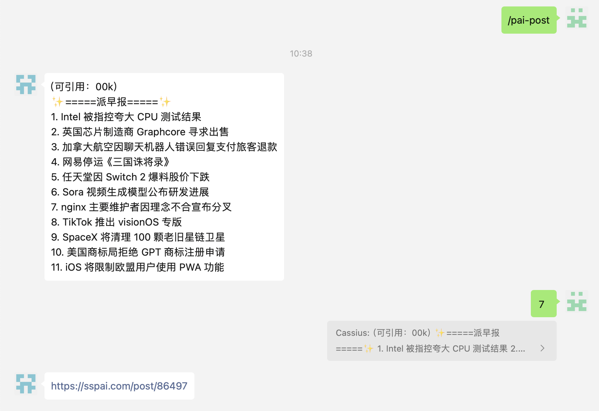
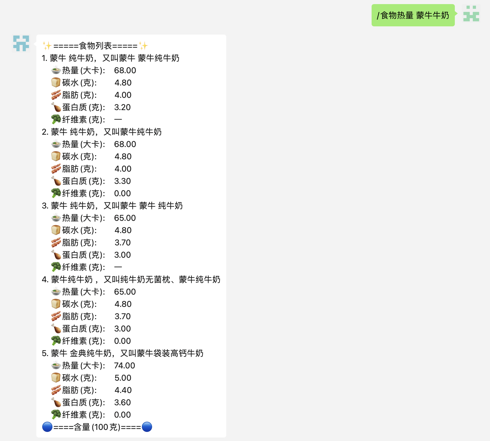
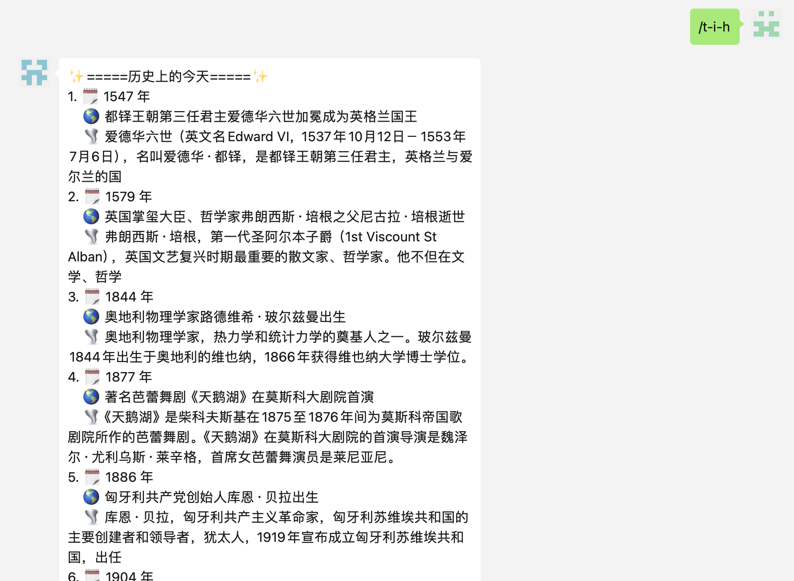

# 命令功能展示

本文档展示了 WeChatter 支持的命令功能。

## 目录
- [游戏基本命令](#游戏基本命令)
  - [创建游戏](#创建游戏)
  - [加入游戏](#加入游戏)
  - [开始游戏](#开始游戏)
  - [进行游戏](#进行游戏)
  - [结束游戏](#结束游戏)
  - [查看游戏列表](#查看游戏列表)
- [天气预报](#天气预报)
- [待办清单](#待办清单)
  - [添加待办](#添加待办)
  - [删除待办](#删除待办)
  - [查看待办](#查看待办)
- [Bilibili 热搜](#Bilibili-热搜)
- [知乎热搜](#知乎热搜)
- [微博热搜](#微博热搜)
- [抖音热搜](#抖音热搜)
- [GitHub 趋势](#GitHub-趋势)
- [GPT 问答](#GPT-问答)
  - [持续对话](#持续对话)
  - [新建对话](#新建对话)
  - [所有对话](#所有对话)
  - [继续对话](#继续对话)
  - [对话记录](#对话记录)
- [单词词语翻译](#单词词语翻译)
- [少数派早报](#少数派早报)
- [人民日报](#人民日报)
- [二维码生成](#二维码生成)
- [食物热量](#食物热量)
- [中石化92号汽油指导价](#中石化92号汽油指导价)
- [冷知识](#冷知识)
- [每日环球视野](#每日环球视野)

## 游戏基本命令

### 创建游戏

### 加入游戏

### 开始游戏

### 进行游戏

### 结束游戏

### 查看游戏列表

## 天气预报

## 待办清单

### 添加待办

### 删除待办

### 查看待办

## Bilibili 热搜

## 知乎热搜

## 微博热搜

## 抖音热搜

## GitHub 趋势

## GPT 问答

### 持续对话

### 新建对话

### 所有对话

### 继续对话

### 对话记录

## 单词词语翻译

## 少数派早报

## 人民日报

### PDF 文件

### 日报链接

## 二维码生成

## 食物热量

## 中石化92号汽油指导价

## 冷知识

## 每日环球视野

